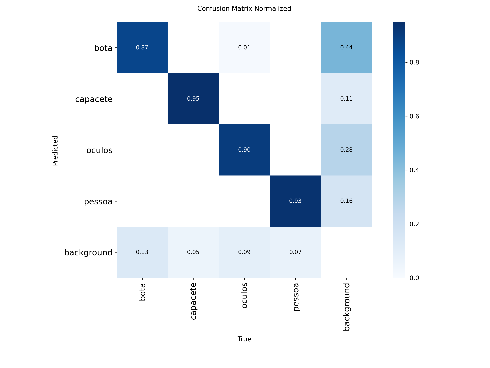
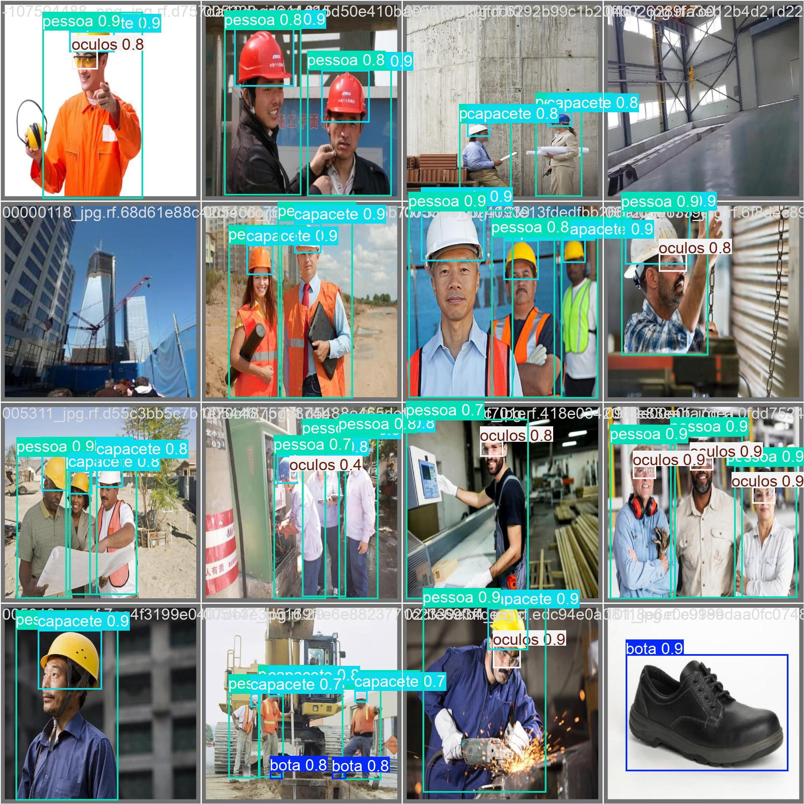
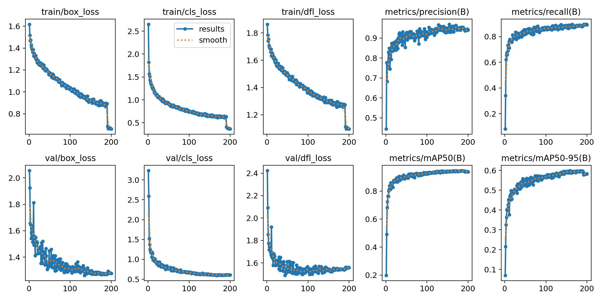

# Sistema de Monitoramento de EPIs com Raspberry Pi e YOLOv8 🚨📷

Este projeto utiliza um modelo de detecção de objetos **YOLOv8n** para monitorar o uso correto de Equipamentos de Proteção Individual (EPIs) em tempo real. O sistema é projetado para ser executado em dispositivos de borda como a **Raspberry Pi 4**, com aceleração opcional via **Coral Edge TPU**, e se integra a serviços em nuvem como **Firebase** e **Telegram** para alertas e monitoramento.

## 📋 Tabela de Conteúdos
1. [Funcionalidades](#-funcionalidades)
2. [Informações do Modelo](#-informações-do-modelo)
    - [Arquitetura](#arquitetura)
    - [Classes Detectadas](#classes-detectadas)
    - [Treinamento](#treinamento)
    - [Performance](#performance)
3. [Arquivos do Modelo](#-arquivos-do-modelo)
4. [Tecnologias e Ferramentas](#-tecnologias-e-ferramentas)
5. [Estrutura do Projeto](#-estrutura-do-projeto)
6. [Configuração e Execução](#-configuração-e-execução)
7. [Recursos do Projeto](#-recursos-do-projeto)
8. [Licença](#-licença)

## 🎯 Funcionalidades

- 📦 Detecção em tempo real com YOLOv8 (PyTorch) ou TensorFlow Lite.
- 🧠 Aceleração de inferência com **Coral Edge TPU** (usando o modelo `.tflite` quantizado).
- 🔥 Integração com **Firebase Firestore** para registro de alertas e armazenamento de imagens.
- 📲 Notificações instantâneas de não conformidade via **Telegram Bot**.
- 🌐 Painel web hospedado no **Firebase Hosting** para:
  - Autenticação de usuários.
  - Visualização de histórico de ocorrências com imagens.
  - Gerenciamento de usuários e zonas de monitoramento.

---

## 🧠 Informações do Modelo

### Arquitetura
O modelo de detecção é baseado na arquitetura **YOLOv8n (nano)**, a menor e mais rápida da família YOLOv8, ideal para aplicações em dispositivos de borda com recursos limitados.

### Classes Detectadas
O modelo foi treinado para detectar as seguintes 4 classes:
- `pessoa`
- `capacete`
- `oculos`
- `bota`

### Treinamento
O modelo foi treinado por **200 épocas** usando o framework Ultralytics. O comando de treinamento e os principais hiperparâmetros estão detalhados abaixo.

**Comando de Treinamento:**
```bash
!yolo task=detect mode=train \
model=yolov8n.pt \
data=/content/data.yaml \
epochs=200 \
imgsz=640 \
batch=32 \
optimizer=AdamW \
lr0=0.0005 \
lrf=0.01 \
weight_decay=0.0005 \
warmup_epochs=3 \
warmup_momentum=0.9 \
warmup_bias_lr=0.1 \
close_mosaic=10 \
mosaic=0.8 \
mixup=0.15 \
copy_paste=0.1 \
hsv_h=0.015 hsv_s=0.5 hsv_v=0.4 \
degrees=10 translate=0.1 scale=0.2 shear=5 \
fliplr=0.5 \
amp=True \
cos_lr=True \
project="epi_treinamento" \
name="yolov8n_adamw_200epocas"
```

### Performance
O modelo alcançou os seguintes resultados na validação final.

**Métricas de Desempenho por Classe:**

| Classe    | Imagens | Instâncias | Precision (P) | Recall (R) | mAP50      | mAP50-95   |
| :-------- | :------ | :--------- | :------------ | :--------- | :--------- | :--------- |
| **Todos** | **232** | **704**    | **0.947**     | **0.873**  | **0.939**  | **0.599**  |
| Bota      | 63      | 152        | 0.897         | 0.809      | 0.893      | 0.582      |
| Capacete  | 80      | 138        | 0.969         | 0.914      | 0.959      | 0.624      |
| Óculos    | 107     | 124        | 0.947         | 0.862      | 0.941      | 0.538      |
| Pessoa    | 201     | 290        | 0.974         | 0.908      | 0.963      | 0.654      |

**Visualizações do Treinamento:**

**Matriz de Confusão Normalizada:**
*Mostra a precisão do modelo na classificação de cada objeto.*


**Resultados da Validação:**
*Exemplo de predições do modelo em um lote de validação.*


**Curvas de Métricas:**
*Gráficos mostrando a evolução das métricas e da função de perda ao longo do treinamento.*


---

## 📦 Arquivos do Modelo

Os modelos treinados e convertidos estão localizados na pasta `models/`:
- `models/yolov8n_pt/weights/best.pt`: Modelo treinado no formato PyTorch. Ideal para inferência em servidores ou máquinas com GPU.
- `models/yolo_last_full_integer_quant_edgetpu.tflite`: Modelo convertido para TensorFlow Lite, com quantização de inteiros completos e otimizado para o **Google Coral Edge TPU**.
- `models/yolov8n_edgetpu/`: Contém outras versões do modelo TFLite com diferentes tipos de quantização (`float16`, `int8`, etc.).

---

## 🛠️ Tecnologias e Ferramentas

- **Hardware:** Raspberry Pi 4, Webcam, Coral Edge TPU (opcional).
- **Software (Python):** `ultralytics`, `opencv-python`, `firebase-admin`, `requests`.
- **Cloud & Backend:** Firebase (Firestore, Hosting, Authentication).
- **Notificações:** Telegram Bot API.

---

## 📁 Estrutura do Projeto
```
.
├── config/                  # Arquivos de configuração (templates)
├── models/                  # Modelos treinados (PyTorch e TFLite)
├── src/                     # Código fonte da aplicação de detecção
├── sistema_de_monitoramento/  # Arquivos do frontend web
├── LICENSE
└── README.md
```

---

## 🚀 Configuração e Execução

### 1. Pré-requisitos
- Python 3.9+
- Node.js e npm (para a CLI do Firebase)
- Conta no Firebase e um Bot no Telegram

### 2. Clone o Repositório
```bash
git clone https://github.com/SEU_USUARIO/SEU_REPOSITORIO.git
cd SEU_REPOSITORIO
```

### 3. Ambiente Python
1. Crie um ambiente virtual e instale as dependências:
   ```bash
   python -m venv venv
   source venv/bin/activate  # Windows: venv\Scripts\activate
   pip install ultralytics opencv-python firebase-admin requests
   ```
2. Configure as credenciais (Firebase, Telegram) e caminhos dos modelos no script `src/deteccao_example.py`.

### 4. Ambiente Web (Firebase)
1. Instale a CLI do Firebase: `npm install -g firebase-tools`
2. Faça login: `firebase login`
3. Configure o projeto: `firebase init hosting` (use `sistema_de_monitoramento` como diretório público).
4. Faça o deploy: `firebase deploy --only hosting`

### 5. Execução
Com a câmera conectada e as configurações preenchidas, execute o script de detecção:
```bash
python src/deteccao_example.py
```
Pressione `ESC` para sair.

Para uma explicação detalhada sobre a arquitetura do script, a lógica de detecção e todas as opções de configuração, consulte o nosso **[Guia Detalhado do Script de Detecção](docs/script_guide.md)**.

---

## 🌐 Recursos do Projeto

- **Notebook de Treinamento:** [Google Colab](https://colab.research.google.com/drive/1BYr0z8BnVe3F1YGCx2pwszZ-OZauiF_r)
- **Notebook de Conversão TFLite:** [Google Colab](https://colab.research.google.com/drive/1MSoOiP4-XVVnBDQYYUN5ZcejGe85FNOt)

---

## 📜 Licença
Este projeto é licenciado sob a MIT License. Veja o arquivo [LICENSE](LICENSE) para detalhes.
